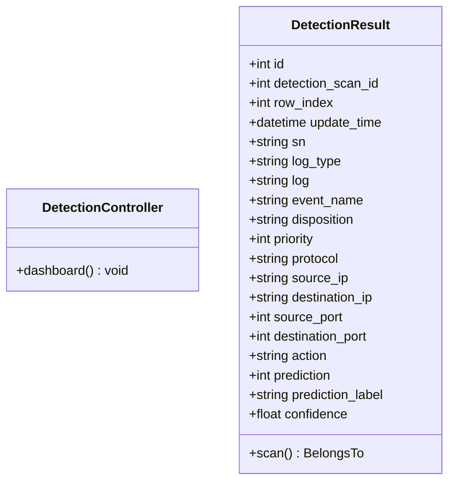
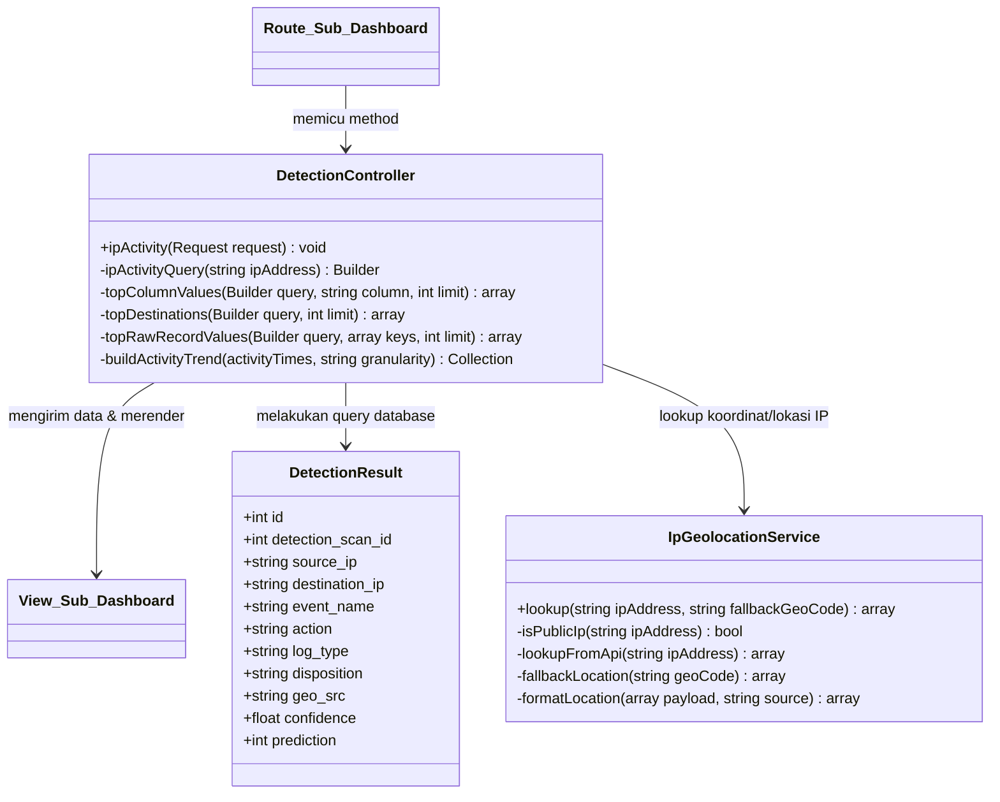
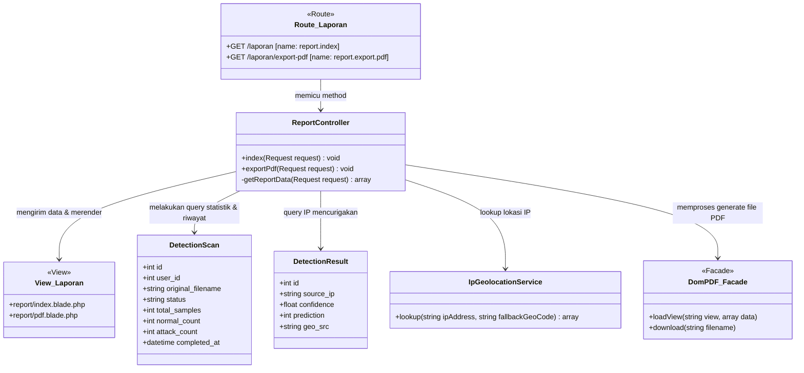
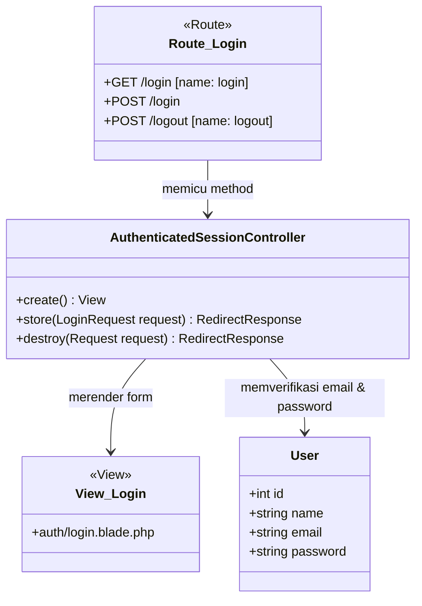
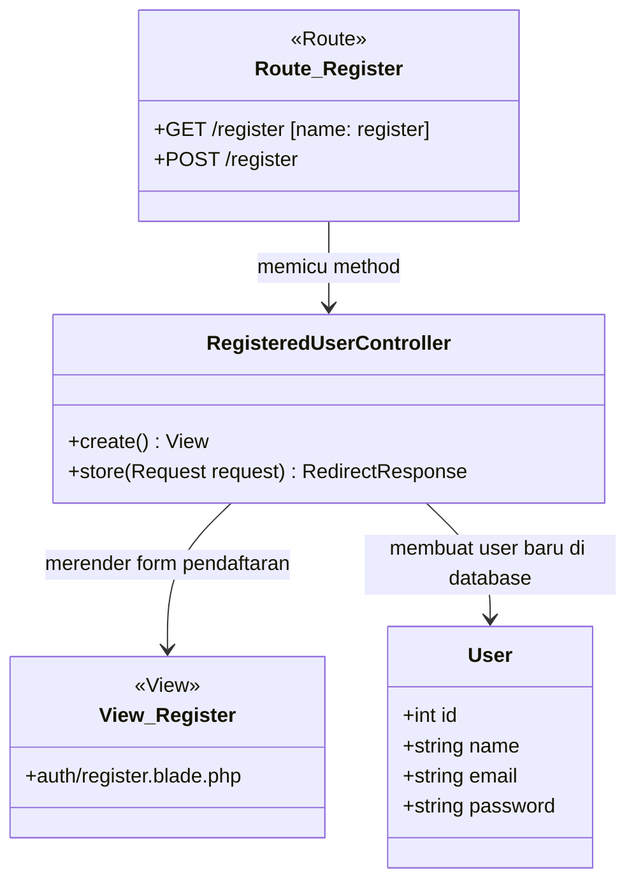

# Class Diagrams per Halaman (Page Modules)

Dokumen ini berisi Class Diagram yang digenerate/dikonversi langsung dari kode sumber PHP Laravel (`routes/web.php`, `app/Http/Controllers`, `app/Models`, dan `resources/views`). Class diagram disusun **per halaman (page-based)** untuk menggambarkan interaksi nyata dari route, view, controller, dan model yang menyusun halaman tersebut.

---

## 1. Halaman Dashboard

Halaman ini berfungsi untuk menampilkan ringkasan eksekutif hasil deteksi malware secara visual dan statistik akumulasi deteksi.



---

## 2. Halaman Sub Dashboard / Detail Top IP (dengan Geolokasi)

Halaman ini digunakan untuk melihat aktivitas log mendalam dari IP address tertentu, dilengkapi dengan fitur integrasi Geolokasi IP.



---

## 3. Halaman Laporan

Halaman laporan memuat statistik performa scan dari seluruh sistem, riwayat scan, IP mencurigakan, dan generator dokumen cetak PDF.



---

## 4. Halaman Kelola Data User

Halaman administrasi khusus untuk mengelola data user (CRUD: Create, Read, Update, Delete) yang terdaftar di sistem.

```mermaid
classDiagram
    class Route_Kelola_User {
        <<Route>>
        +GET /admin/users [name: admin.users.index]
        +GET /admin/users/create [name: admin.users.create]
        +POST /admin/users [name: admin.users.store]
        +DELETE /admin/users/{user} [name: admin.users.destroy]
    }

    class View_Kelola_User {
        <<View>>
        +admin/users/index.blade.php
        +admin/users/create.blade.php
    }

    class AdminUserController {
        +index(Request request) View
        +create() View
        +store(Request request) RedirectResponse
        +destroy(Request request, User user) RedirectResponse
        -validatedUserData(Request request) array
        -syncUserAccess(User user, string role, array permissions) void
    }

    class User {
        +int id
        +string name
        +string email
        +string password
        +string avatar
    }

    Route_Kelola_User --> AdminUserController : memicu method
    AdminUserController --> View_Kelola_User : mengirim data & merender
    AdminUserController --> User : melakukan operasi database CRUD
```

---

## 5. Halaman Hak Akses

Halaman untuk mengatur role dan permission (izin akses menu) dari masing-masing user secara dinamis.

```mermaid
classDiagram
    class Route_Hak_Akses {
        <<Route>>
        +GET /admin/permissions [name: admin.permissions.index]
        +GET /admin/permissions/{user}/edit [name: admin.permissions.edit]
        +PUT /admin/permissions/{user} [name: admin.permissions.update]
    }

    class View_Hak_Akses {
        <<View>>
        +admin/permissions/index.blade.php
        +admin/permissions/edit.blade.php
    }

    class AdminPermissionController {
        +index(Request request) View
        +edit(User user) View
        +update(Request request, User user) RedirectResponse
    }

    class AccessControl {
        +permissions() array
        +permissionNames() array
        +ensureRolesAndPermissions() void
        +assignDefaultUserAccess(User user) void
        +assignAdminAccess(User user) void
    }

    class User {
        +int id
        +string name
        +string email
    }

    Route_Hak_Akses --> AdminPermissionController : memicu method
    AdminPermissionController --> View_Hak_Akses : mengirim data & merender
    AdminPermissionController --> AccessControl : mensinkronkan konfigurasi permission
    AdminPermissionController --> User : mengambil & memperbarui permission user
```

---

## 6. Halaman Login

Halaman otentikasi agar pengguna masuk ke sistem menggunakan alamat email dan password mereka.



---

## 7. Halaman Register

Halaman pendaftaran bagi pengguna baru untuk membuat akun di dalam sistem.



---

## 8. Halaman Forgot Password

Halaman untuk meminta link reset password melalui email ketika pengguna lupa kata sandi mereka.

```mermaid
classDiagram
    class Route_Forgot_Password {
        <<Route>>
        +GET /forgot-password [name: password.request]
        +POST /forgot-password [name: password.email]
        +GET /reset-password/{token} [name: password.reset]
        +POST /reset-password [name: password.store]
    }

    class View_Forgot_Password {
        <<View>>
        +auth/forgot-password.blade.php
        +auth/reset-password.blade.php
    }

    class PasswordResetLinkController {
        +create() View
        +store(Request request) RedirectResponse
    }

    class NewPasswordController {
        +create(Request request) View
        +store(Request request) RedirectResponse
    }

    class User {
        +int id
        +string email
        +string password
    }

    Route_Forgot_Password --> PasswordResetLinkController : memproses permintaan email
    Route_Forgot_Password --> NewPasswordController : memproses ubah password baru
    PasswordResetLinkController --> View_Forgot_Password : merender form minta link
    NewPasswordController --> View_Forgot_Password : merender form password baru
    NewPasswordController --> User : mengupdate password baru di database
```
